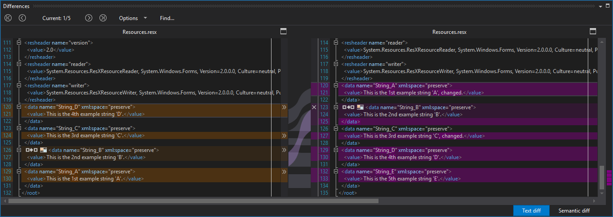
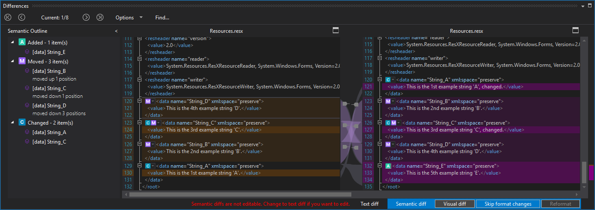
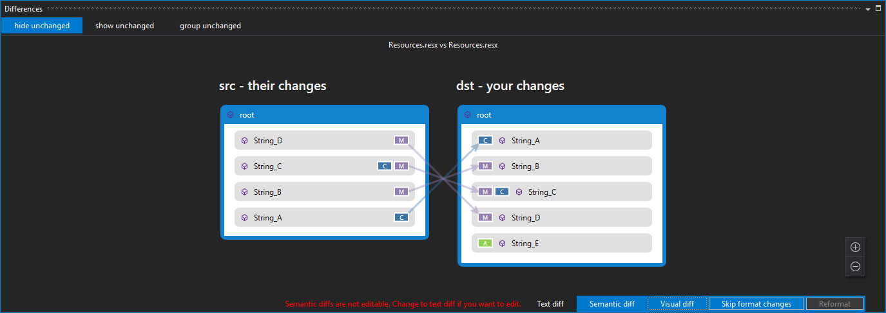

# resx-semantic-external-parser
A semantic external parser for .resx files that can be used together with [GMaster](https://gmaster.io), [PlasticSCM](https://www.plasticscm.com) or [SemanticMerge](https://semanticmerge.com/).

How to use it with GMaster is documented [here](http://blog.gmaster.io/2018/03/using-external-parsers-with-gmaster.html).

How to use it with _**SemanticMerge**_ or _**Plastic SCM**_ is described [here](https://users.semanticmerge.com/documentation/external-parsers/external-parsers-guide.shtml) in chapter _"How to invoke Semantic with an external parser"_.

## Build status

## Issues
Please raise issues on [GitHub](https://github.com/RalfKoban/resx-semantic-external-parser/issues).
If you can repeat the issue then please provide a sample to make it easier for me to also repeat it and then implement a fix.

Please do not hijack unrelated issues, I would rather you create a new issue than add noise to an unrelated issue.

## Example
Following images give an impression about the different diff results.

#### Text diff

#### Semantic diff

#### Visual diff

